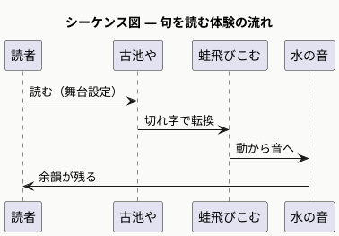
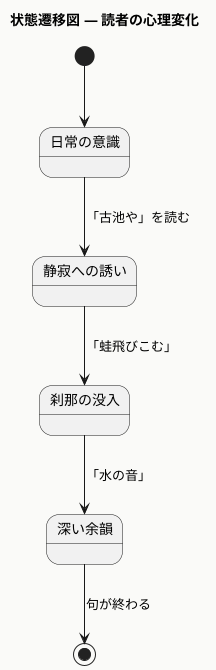

# haiku-science-web スキル 追記事項 v2
## 出力フォーマット改訂・シーケンス図・状態遷移図追加（2025年5月）

---

## 出力セクションの構造（確定版）

Copilot形式を参考に4セクション構成に変更。

```
📐 出力構造
├── ヘッダー（俳句原文・読み・総評1行）
├── 🌿 季語の判定（季語名・季節・歳時記分類・句中の働き）
├── 🍶 句の読みと鑑賞（語句解説・上五中七下五構造分析）
├── 📊 評価ポイント（観点テーブル＋スコアバー）
├── 🔍 アドバイス（2〜3項目の推敲提案）
└── 📐 C4モデル構造図（5タブ）
    ├── L1 Context
    ├── L2 Container
    ├── L3 Component
    ├── シーケンス図（体験の流れ）
    └── 状態遷移図（心理状態変化）
```

---

## Claude API 評価プロンプト（確定版）

```javascript
function buildEvalPrompt(inp) {
  return `俳句の科学の専門家として、以下の俳句を詳細に評価してください。

俳句：${inp.haiku}
...

JSON形式のみで返答：
{
  "overall": "句の総評（1〜2文）",
  "kigo_body": "🌿季語の判定：季語の名前・季節・歳時記分類・句中での働きを詳しく説明（3〜5文）",
  "kigo": 数値0-100,
  "kansha": "🍶句の読みと鑑賞：語句ごとの解説と全体評価（5〜8文）",
  "t_kigo": "良／高い／やや弱い／普通",
  "t_kigo_c": "季語の働きについての短評",
  "t_photo": "良／高い／やや弱い／普通",
  "t_photo_c": "写生性についての短評",
  "t_ma": "良／高い／やや弱い／普通",
  "t_ma_c": "余情についての短評",
  "t_rhythm": "良／高い／やや弱い／普通",
  "t_rhythm_c": "リズムについての短評",
  "summary": "全体評価（2〜3文）",
  "sound": 数値0-100,
  "ma": 数値0-100,
  "scene": 数値0-100,
  "advice": "🔍アドバイス（2〜3項目）"
}`;
}
```

---

## PlantUML 5種プロンプト（確定版）

```javascript
function buildPumlPrompt(inp) {
  // ctx / ctr / cmp / seq / sta の5種を要求
  // シーケンス図：読者が句を読む体験の時系列
  // 状態遷移図：読む前→読む中→読んだ後の心理状態変化
}
```

### シーケンス図テンプレート


### 状態遷移図テンプレート


---

## 評価テーブルHTML構造

```html
<table class="eval-table">
  <thead>
    <tr><th>観点</th><th>評価</th><th>コメント</th></tr>
  </thead>
  <tbody>
    <tr><td>季語の働き</td><td id="ev-t-kigo">—</td><td id="ev-t-kigo-c">—</td></tr>
    <tr><td>写生性</td><td id="ev-t-photo">—</td><td id="ev-t-photo-c">—</td></tr>
    <tr><td>余情</td><td id="ev-t-ma">—</td><td id="ev-t-ma-c">—</td></tr>
    <tr><td>リズム</td><td id="ev-t-rhythm">—</td><td id="ev-t-rhythm-c">—</td></tr>
  </tbody>
</table>
```

---

## 蝦蛄（しゃこ）等の難読語対応

漢字はひらがな入力タブで対応を促す設計を維持。
漢字タブの「読み仮名欄」に「しゃこ」と入力することで正確にカウント可能。

漢字タブでの入力例：
- 原文：昼酒につまみ蝦蛄五尾ゆめのごと
- 上五の読み：ひるざけに（4音 → 警告表示）
- 中七の読み：つまみしゃここびゆめ（9音 → 警告）
- ※ 正しくは「ひるざけに」5音、「つまみしゃここつを」7音、「ゆめのごと」5音

ポイント：**蝦蛄五尾**の読みは「しゃここつを」ではなく「しゃここいつを」等、
ユーザーが正しい読みを入力することで17音判定が機能する。
AIは入力された読み仮名を優先して句を解析する。
